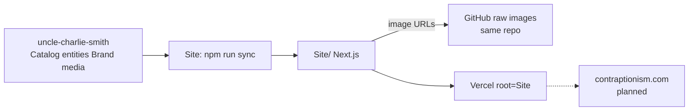

# Archive + site relationship

One GitHub repo: **`WalksWithASwagger/uncle-charlie-smith`** (local: `/Users/kk/Code/UncleCharlie`).

| Path | What | Touch for… |
|------|------|------------|
| Repo root | Canonical archive | Works, entities, brand, catalog, media |
| `Site/` | Public Next.js site | UI, routes, agent, deploy |

**Former sibling** `contraptionism-site` was merged into `Site/` (2026-07). Do not maintain a separate site repo.
